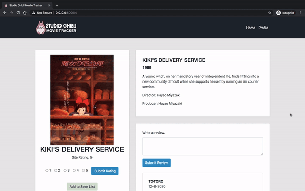
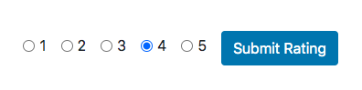
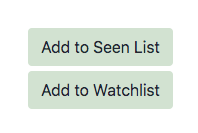
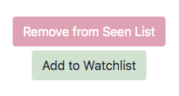
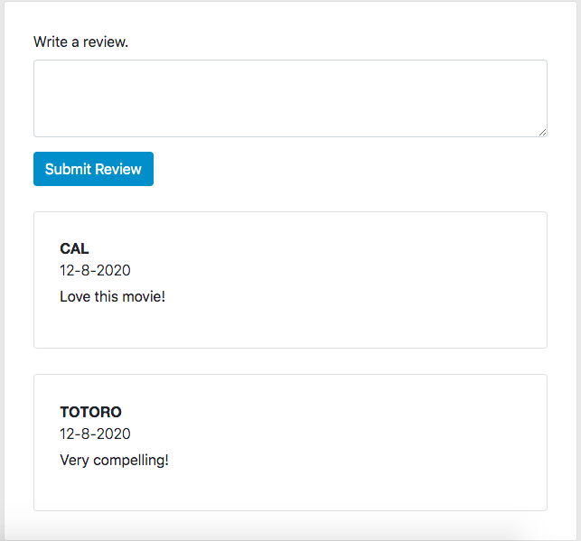
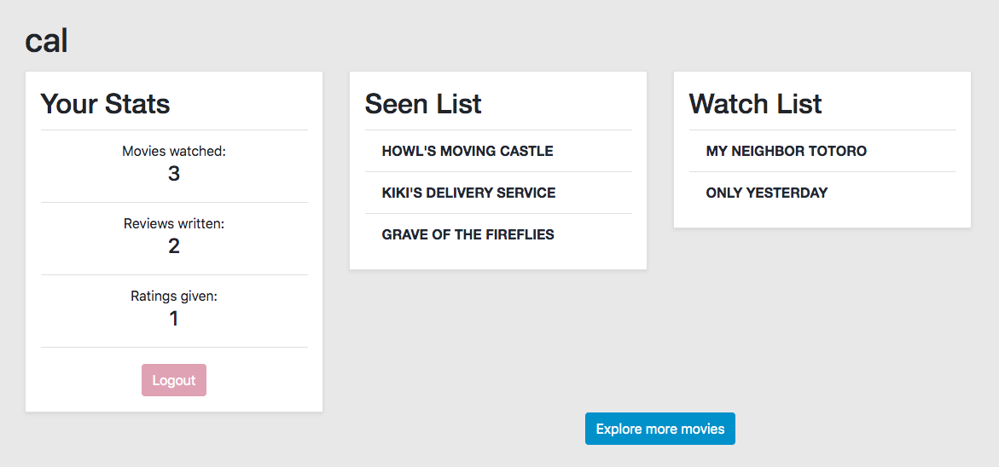
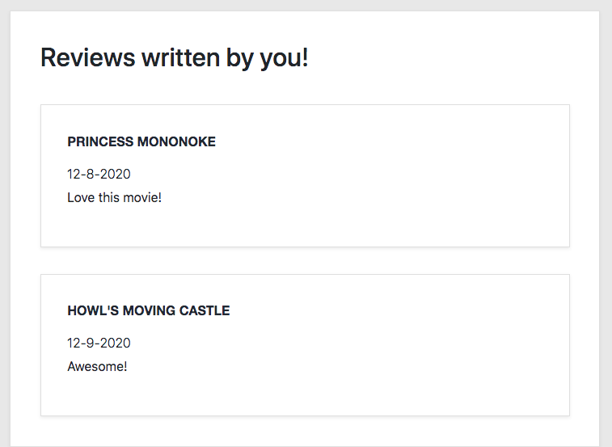

<h1 align="center">
    
</h1>

The Studio Ghibli Tracker allows the user to keep track of the Studio Ghibli films they’ve seen, explore details about the film, and rate and review them.

[Watch a video demo of the app here!](https://www.youtube.com/watch?v=7IYSztzpgFQ)

# Content
- [Tech Stack](#tech-stack)
- [App Features](#app-features)

#  Tech Stack 

- Python
- JavaScript
- PostgreSQL
- SQLAlchemy
- jQuery
- Flask
- Jinja
- HTML
- CSS
- Bootstrap

#  App Features

## Login Page

When first entering the app, the user lands on the login page if they are not already logged in.

<h1 align="center">
    
</h1>

### Create an Account
A user must first create an account with a unique username and email before engaging with the app.

If an email or username is already in the database, the user will get a warning.
<h1 align="center">
    
</h1>

### Login to Account
Once a user has an account, they can login.

If the email, username, or password is incorrect, the user will get a warning notifying them of the issue.
<h1 align="center">
    
    
</h1>

## Homepage
On the homepage, users can scroll through the different Studio Ghibli films sorted by release date.
<h1 align="center">
    
</h1>

## Movie Details

Each movie has its own details page.
<h1 align="center">
    
</h1>

A user can rate the movie on a scale from 1 to 5. This rating will influence the overall site rating.
<h1 align="center">
    
</h1>

A user can add and remove the movie from their Watch and Seen lists.

<h1 align="center">
    
    
</h1>

A user can write and read reviews of the movie.

<h1 align="center">
    
</h1>

## User Profile

Each user has their own profile page where they can view their statistics, their Watch and Seen lists, and reviews they've written.

<h1 align="center">
    
    
</h1>

---

Thank you for reading about the Studio Ghibli Movie Tracker :)